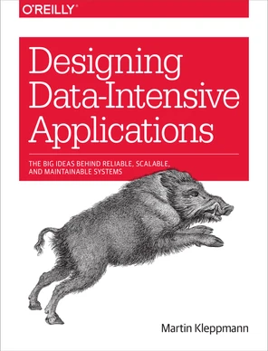

## Hi, I'm Erlon Avelino

-  **Data Science & Artificial Intelligence undergraduate**, working across **Data Analysis, Data Engineering, Applied AI, and Software Engineering**.

-  **Data Analyst I @ Zoox Smart Data**

  - At Zoox, I work with **Python, ETL pipelines, data integration, data quality, APIs, and large-scale datasets**, including datasets built from **30+ public and external sources** and exceeding **30M records**.

-  Experienced in building **data-intensive** **and AI-powered systems**, including **LLM applications, natural-language interfaces for structured data, document extraction pipelines, backend APIs, and analytical workflows**.

-  **Research experience** spanning **Machine Learning, geospatial analysis, Large Language Models, Applied NLP, and Data Mining**.

  - **Co-author of research** involving **CO₂ clustering and geospatial analysis** and **mental health and GPT usage among college students**.

  - Author of an **Applied NLP paper accepted at SBBD 2026**.

### Core Areas

- **Languages:** Python, JavaScript, TypeScript  
- **Web & Full-Stack Development:** Vue.js, React, FastAPI, Node.js, REST APIs, HTML/CSS, responsive web development  
- **Data Science & AI:** Pandas, data analysis, data visualization, machine learning, deep learning, NLP, Transformers, Hugging Face, PyTorch  
- **Data Engineering & Databases:** ETL/data pipelines, web scraping, data extraction, data processing, MySQL, relational databases  
- **Software Engineering & DevOps:** Git, GitHub, Docker, GitHub Actions, CI/CD, automated testing, modular architecture, API integration  

### Links
  
🌐 **[Personal Website](https://erlonl.github.io/)**  
💼 **[LinkedIn](https://www.linkedin.com/in/erlon-avelino/)**  
📧 **[erlonlacerda1@gmail.com](mailto:erlonlacerda1@gmail.com)**  

#### Pages

- 🌐 [erlonL.github.io](https://erlonL.github.io/erlonL.github.io) - A personal homepage presenting my profile, interests, and featured work.
- 🍃 [Breez🥉 @ NASA](https://biabcaval.github.io/space_apps_hackaton/) - A NASA Space Apps project focused on air quality and climate intelligence with location-based environmental insights.
- ⚖️ [equidar🥉 @ Devs de Impacto](https://erlonL.github.io/equidar) - A social-impact project aimed at equity and inclusion themes.
- 🎓 [AdaptAI](https://github.com/erlonL/AdaptAI) - An AI-assisted educational inclusion prototype that helps teachers adapt class materials and assessments for students with special educational needs.
- 🧠 [pln-demo](https://erlonL.github.io/pln-demo) - A Natural Language Processing demo showcasing language analysis in practice.   
- 📚 [saeb](https://erlonL.github.io/saeb) - An education-oriented project related to SAEB data and insights.
- 🎬 [cinemAnalyzer](https://erlonL.github.io/cinemAnalyzer) - A movie analysis project exploring cinema data and trends.   
- 📸 [photo-collection](https://erlonL.github.io/photo-collection) - A visual gallery project for organizing and displaying photos.   
- 📸 [my-3d-collection](https://erlonL.github.io/my-3d-collection) - A 3D photo album you can feel.   
- 📊 [dataviz](https://erlonL.github.io/dataviz) - A data visualization project with pretty charts and exploratory views.   
- 🚗 [unicarona-ci](https://erlonL.github.io/unicarona-ci) - A carpooling-focused project with an academic/community context.   
- 💸 [racha-uber-ci](https://erlonL.github.io/racha-uber-ci) - A cost-splitting app concept for shared Uber rides.
- 🍪 [cookie](https://erlonL.github.io/cookie) - A small web project focused on a playful cookie-themed experience.   
- 🤝 [comunidados-landing](https://erlonL.github.io/comunidados-landing) - A landing page project for the Comunidados initiative.   
- ✨ [summaraizer](https://erlonL.github.io/summaraizer) - An AI summarization tool designed to condense long texts quickly.   
